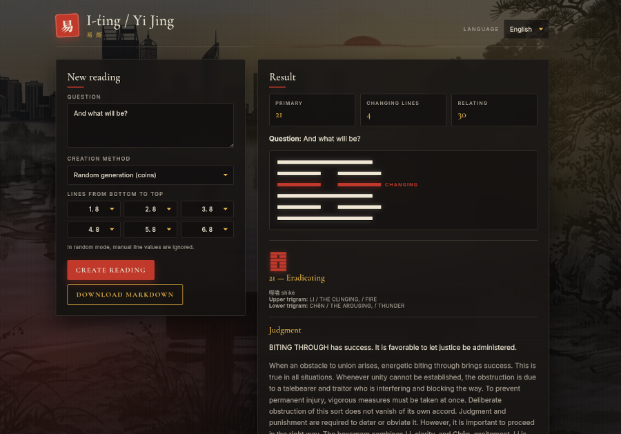

# I Ching App

A Go application for I Ching divination with a Fiber-based HTTP API, a browser frontend, and persistent reading storage. The current project supports SQLite, PostgreSQL, and in-memory repositories, and stores each reading together with the original question, line data, interpretation payload, and optional reflection fields. 




## Buy me a coffee, if you like and use this app

[](https://www.buymeacoffee.com/petrstepanek99)
## Overview

The application is structured as a small web app. A Go backend handles reading generation and persistence, while the frontend is served as static files from `cmd/api/static`. The API currently exposes endpoints for listing readings, fetching a reading by ID, creating a reading, and creating a randomized reading. 

Each stored reading includes:
- question text,
- cast method,
- language,
- raw line values,
- primary and relating hexagram numbers,
- serialized interpretation,
- optional reflection rating, note, and timestamp,
- creation timestamp.

## Architecture

Main components in the current project:

- `cmd/api` — application entrypoint and startup logic.
- `internal/httpfiber` — Fiber app configuration and HTTP routes.
- `internal/service` — application and reading logic. 
- `internal/storage/sqlite` — SQLite persistence for saved readings. 
- `internal/storage/postgres` — PostgreSQL repository option.
- `internal/storage/memory` — in-memory fallback repository.
- `web/static` — browser UI served by the backend. 

## Storage backends

The repository is selected by application configuration. If `cfg.Storage` is set to `sqlite`, the app opens `cfg.SQLitePath` and uses the SQLite repository. If it is set to `postgres`, the app connects through `cfg.PostgresDSN`. Any other value falls back to in-memory storage. 

### SQLite

The SQLite repository creates a `readings` table if it does not exist and stores both structured fields and serialized JSON payloads. The current schema includes `question`, `method`, `language`, `lines_json`, `primary_number`, `relating_number`, `changing_lines_json`, `interpretation_json`, reflection fields, and `created_at`. 

Reads are ordered by `created_at DESC`, which means the latest saved readings appear first in history. The repository also supports loading a single reading by ID and updating reflection data with `SaveReflection(...)`.

### PostgreSQL

PostgreSQL is available as an alternative repository and is activated when the storage mode is `postgres`. The application opens the connection using `sql.Open("pgx", cfg.PostgresDSN)`.

### In-memory mode

In-memory storage is only a fallback. It is useful for tests or temporary runs, but readings are not persisted across process restarts. 
## API endpoints

The current HTTP layer exposes these routes:

| Method | Path | Description |
|---|---|---|
| GET | `/health` | Returns a simple health response. |
| GET | `/api/readings` | Returns the saved reading history. |
| GET | `/api/readings/:id` | Returns one saved reading by ID. |
| POST | `/api/readings` | Creates a reading from the request payload.  |
| POST | `/api/readings/random` | Creates a randomized reading using coin casting mode.  |

The frontend is currently served by `app.Static("/", "./web/static")`, so static files must exist in that directory unless the app is later changed to embedded assets. 

## Run locally

Start the application with:

```bash
go run ./cmd/api
```

The current startup code loads configuration, initializes the selected repository, creates the reading service, builds the Fiber app, and starts listening on `cfg.Addr`. It also installs graceful shutdown handling for `SIGINT` and `SIGTERM`. 

## Configuration

The current application behavior depends on `config.Load()`, which supplies values such as storage mode, SQLite path, PostgreSQL DSN, and listen address. The startup logic clearly branches by `cfg.Storage`, so that setting is the key switch between persistent and non-persistent modes. 

Typical local values are:

```env
STORAGE=sqlite
SQLITE_PATH=iching.db
ADDR=:8080
```

If you want PostgreSQL instead, use a valid `POSTGRES_DSN` and set `STORAGE=postgres`. 

## Windows build

A Windows binary can be built with standard Go cross-compilation using `GOOS=windows` and `GOARCH=amd64`. This is the normal Go approach for producing a `.exe` from the API entrypoint. 

Example:

```bash
CGO_ENABLED=0 GOOS=windows GOARCH=amd64 go build -o iching.exe ./cmd/api
```

With the current static-file setup, distributing only the `.exe` is not enough unless you also embed `web/static` into the Go binary. Otherwise the frontend files must still be available on disk. 

## Browser behavior

In the currently known `main.go`, the application starts the server and logs the listening address, but it does not automatically launch the browser. Browser auto-open would need to be added explicitly in startup code.

## Release Management

### Local Release Build

To build release packages for all platforms (Linux, Windows, macOS):

```bash
make release-build
```

This will:
1. Run code quality checks (tidy, vet, lint, test)
2. Build binaries for all platforms (x86_64 and ARM64 variants)
3. Create compressed archives in `dist/` directory

Individual platform builds:
```bash
make build-linux              # Linux x86_64
make build-linux-arm64        # Linux ARM64
make build-windows            # Windows x86_64
make build-windows-arm64      # Windows ARM64
make build-darwin             # macOS x86_64
```

### Release Workflow (with Git Tags)

1. **Prepare code**: Ensure all changes are committed and tests pass
   ```bash
   make audit  # Runs tidy, vet, lint, test
   ```

2. **Create a release tag**: Tags should follow semantic versioning (e.g., `v0.1.0`, `v1.0.0-beta`)
   ```bash
   git tag -a v0.1.0 -m "Release v0.1.0: Initial release"
   git push origin v0.1.0
   ```

3. **GitHub Actions**: When you push a tag starting with `v`, GitHub Actions automatically:
   - Builds binaries for all platforms
   - Creates compressed archives
   - Creates a GitHub Release with all artifacts

4. **Manual Release Build** (if not using GitHub Actions):
   ```bash
   git tag -a v0.1.0 -m "Release v0.1.0"
   make release-build
   ```

### Distribution Files

Release packages include:
- **Linux**: `iching-api-linux-amd64-vX.Y.Z.tar.gz`, `iching-api-linux-arm64-vX.Y.Z.tar.gz`
- **Windows**: `iching-api-windows-amd64-vX.Y.Z.zip`, `iching-api-windows-arm64-vX.Y.Z.zip`
- **macOS**: `iching-api-darwin-amd64-vX.Y.Z.tar.gz`, `iching-api-darwin-arm64-vX.Y.Z.tar.gz`

Each archive contains:
- Compiled binary for the platform
- `static/` directory with web UI files

### Installation from Release

**Linux/macOS**:
```bash
tar -xzf iching-api-linux-amd64-vX.Y.Z.tar.gz
chmod +x iching-api-linux-amd64
./iching-api-linux-amd64
```

**Windows**:
```cmd
# Extract ZIP file
iching-api-windows-amd64.exe
```

## Notes

- The current SQLite repository stores line data and interpretation data as JSON strings in the database.
- Reading history is returned in reverse chronological order. 
- Reflection persistence is present at repository level through `SaveReflection(...)`, but the currently known HTTP layer does not yet expose dedicated reflection endpoints.
- The current repository scans `language` as a plain string, so nullable historical rows may require a migration or a repository fix if older data contains `NULL` in that column.

This project is released under the Custom Attribution Software License v1.0.

## Attribution
If you reuse, redistribute, or modify this software, you must keep the copyright notice and credit:

 Petr Štěpánek <petrstepanek99@proton.me>

## License
See [LICENSE](LICENSE).
